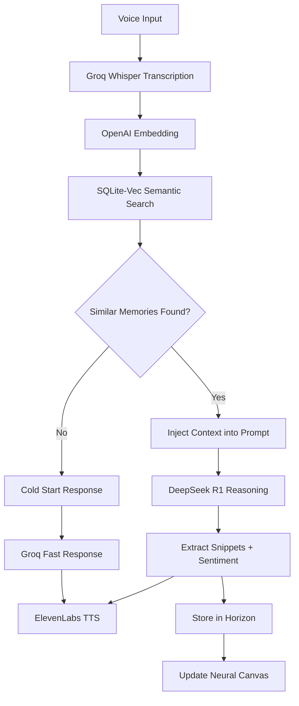

# Hearify Design System: Neural Companion 2026 🧠✨

> **Vision:** ChatGPT-level polish meets neural memory with emotional awareness  
> **Status:** Phase 3 Complete – Core Singularity Architecture Active  
> **Last Updated:** 2025-12-24

---

## 🎯 Design Philosophy: "Obsidian Void 2.0"

Inspired by the best conversational AI interfaces (ChatGPT, Gemini, Claude), Hearify combines **minimalist elegance** with **spatial intelligence** and **emotional resonance**.

### Core Principles:
1. **Center Stage** – The Neural Orb and question are always the hero
2. **Ambient Intelligence** – AI feels present but not overwhelming  
3. **Voice-First, Text-Second** – Natural input prioritized
4. **Memory as Space** – Thoughts become nodes in the Neural Horizon
5. **Emotional Mapping** – Sentiments visualized as colored auras

---

## 📱 HomeScreen Layout (Burger Evolution)

```
┌─────────────────────────────────────┐
│  [≡]        Hearify         [R1]   │  ← Burger Menu Left, R1 Status Right
│                                     │
│                                     │
│             ┌─────────┐             │
│             │    ○    │             │  ← Neural Orb (centered, 200px)
│             └─────────┘             │
│                                     │
│          "Was beschäftigt           │  ← Welcome Prompt
│           dich gerade?"             │     (centered, bold)
│                                     │
│                                     │
├─────────────────────────────────────┤
│      │ Sprich mit mir...  │ [🎤]   │  ← Minimal Input Bar
└─────────────────────────────────────┘
```

### Trinity Swipe Navigation:
- **Swipe UP**: Transition to **Neural Horizon** (The Singularity Bloom).
- **Swipe DOWN**: Transition to **Chronicles** (Memory Bento Grid).
- **Feel**: Pure gestural flow, zero buttons for navigation.

---

## 🌌 The Singularity & Trinity Flow

The Trinity consists of three overlapping spatial dimensions:
1.  **ORBIT (The Present)**: The AI nucleus. Focused on transcription, reasoning, and speech.
2.  **HORIZON (The Subconscious)**: Spatial graph of semantic connections.
3.  **MEMORY (The Past)**: High-density bento grid for analytical reflection.

### Transition: The Singularity Bloom
When moving from **Orbit → Horizon**, the central Orb scales up radically (**1x → 15x**) to act as a "Portal" through which the user enters the neural nebula.

### Physics Engine:
- **Repulsion:** All nodes push each other apart (anti-clutter)
- **Attraction:** Semantic similarity > 0.75 creates spring forces
- **Center Gravity:** Prevents nodes from drifting infinitely

### Emotional Aura System:
| Sentiment | Aura Color | RGB |
|:----------|:-----------|:----|
| Analytical | Cool Blue | `[0.3, 0.5, 1.0]` |
| Positive | Warm Gold | `[1.0, 0.85, 0.2]` |
| Creative | Deep Indigo | `[0.4, 0.3, 0.9]` |
| Neutral | Gray | `[0.4, 0.4, 0.5]` |

### Type Core Colors:
| Type | Core Color | RGB |
|:-----|:-----------|:----|
| Goal | Golden | `[1.0, 0.8, 0.2]` |
| Feeling | Violet | `[0.6, 0.3, 0.9]` |
| Fact | Teal | `[0.1, 0.9, 0.6]` |

---

## 🎨 Color Palette: Obsidian Void 2.0

| Token | Hex | Usage |
|:------|:----|:------|
| `--void` | `#000000` | True black background |
| `--void-soft` | `#0A0A0A` | Card backgrounds |
| `--surface` | `#1A1A1A` | Input fields, overlays |
| `--border` | `rgba(255,255,255,0.08)` | Subtle borders |
| `--text-primary` | `#FFFFFF` | Headlines |
| `--text-secondary` | `#888888` | Hints, timestamps |
| `--accent` | `#6366F1` | Indigo – brand color |
| `--accent-teal` | `#14F195` | Speaking / Success |
| `--accent-violet` | `#A855F7` | Thinking / DeepSeek R1 |
| `--accent-red` | `#EF4444` | Recording active |

---

## 🧩 Component Specifications

### 1. Minimal Input Bar
```
Bottom: insets.bottom + 20px
Height: 56px
Background: rgba(26, 26, 26, 0.95)
Border Radius: 28px
Border: 1px solid rgba(255, 255, 255, 0.08)
Mic Button: 48x48, Indigo (#6366F1)
```

### 2. Side Menu (Drawer)
```
Width: 75% of screen
Animation: SlideInLeft (400ms)
Physics: damping: 25, stiffness: 80
Backdrop: rgba(0, 0, 0, 0.6)
Blur: intensity 80 (iOS)
```

### 3. Neural Orb (HomeScreen)
```
Size: 200x200
Shader: Organic distortion, pulsing with intensity
States: Indigo (Idle), Red (Listening), Violet (Thinking), Teal (Speaking)
```

### 4. Horizon Node (Neural Soul Shader)
```
Size: 60x60
Core: Type-based color (Goal/Feeling/Fact)
Aura: Sentiment-based pulsing glow
Animation: Organic sine/cosine warping
```

---

## ⚡ Neural RAG Pipeline



---

## 📱 Screen Inventory

| Screen | Purpose | Status |
|:-------|:--------|:-------|
| Home | Neural Orb + Conversation | ✅ Complete |
| Horizon | Spatial Memory Canvas | ✅ Complete |
| Memory | Bento Chronicle Grid | 🔄 Next Phase |
| Onboarding | First-time Setup | ✅ Complete |

---

## 🚀 Implementation Checklist (Phase 2 Complete)

- [x] Remove Tab Bar (move navigation to Burger Menu)
- [x] Implement Slide-out Side Menu with smooth animation
- [x] Center Neural Orb on Welcome Screen
- [x] Implement Neural RAG (Context Injection for FastChat)
- [x] Force-Directed Graph with Cosine Similarity
- [x] Emotional Aura Shader (Sentiment Mapping)
- [x] DeepSeek Sentiment Extraction
- [x] Database Schema with Sentiment Field
- [x] **Singularity Bloom Animation** (Orb-to-Canvas Portal)
- [x] **Birth Physics** (Momentum-based Node Ejection)
- [x] **Trinity Swipe Navigation** (Orbit/Horizon/Memory)
- [x] **Holographic Sync** (Zero-polling reactive UI)
- [x] **Bento Chronicle Grid** (Memory Page)
- [x] **Intelligent Memory System** (Deduplication + Merge)
- [x] **Animated Toast Queue** (Feedback serialized)
- [ ] Celo Vault Dashboard (Data Ownership)
- [ ] MCP Expansion (Slack, GitHub, Notion nodes)

---

*"The best AI interface is one that feels like talking to yourself – and seeing your soul."*
